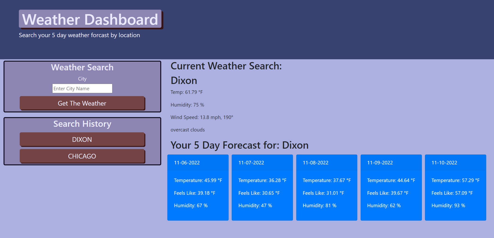

# Weather Dashboard
challenge 6 server-side api's

## Description
With the use of OpenWeatherMap Api's I created an application that allows the user to input a city and get the current weather along with the 5 day forecast. The application also stores your search history in local storage and displays all non-duplicate searches on the left side of the screen.

## Motivation
I wanted to use server side API's to create an application that a user can manipulate and recieve selected data from the server side API's. 

## Comments
I have added comments to more easily understand what each block of code is doing. I added several consol logs to better see what is happening as the application is being manipulated. All console logs can be commented out. I ended up making three api fetches, one for current weather, then to fetch the 5 day weather, it required first fetching longitude and latitude from another api. Most likely more efficient ways to go about fetchind required data, it was just how it organically came to fruition while figuring out how to make the fetches and grab the data I wanted. I used basic javascript and jquery, my initial thought was to continue to practice both, probably made things confusing and sloppy. I did try to stick to certiain sections, but going back and forth from day to day probably left things a bit sloppier that I would have liked.

## Screenshot



## Application

https://jcgilbert70.github.io/weather-dashboard/

## Repository

https://github.com/jcgilbert70/weather-dashboard.git

## Acceptance Criteria

```md
GIVEN a weather dashboard with form inputs
WHEN I search for a city
THEN I am presented with current and future conditions for that city and that city is added to the search history
WHEN I view current weather conditions for that city
THEN I am presented with the city name, the date, an icon representation of weather conditions, the temperature, the humidity, and the wind speed
WHEN I view future weather conditions for that city
THEN I am presented with a 5-day forecast that displays the date, an icon representation of weather conditions, the temperature, the wind speed, and the humidity
WHEN I click on a city in the search history
THEN I am again presented with current and future conditions for that city
```

## Built Using

```
JavaScript
Bootstrap
Moment.js
jquery
fontawesome
```

## Credits

N/A

## License

Please refer to the LISCENSE in the repo